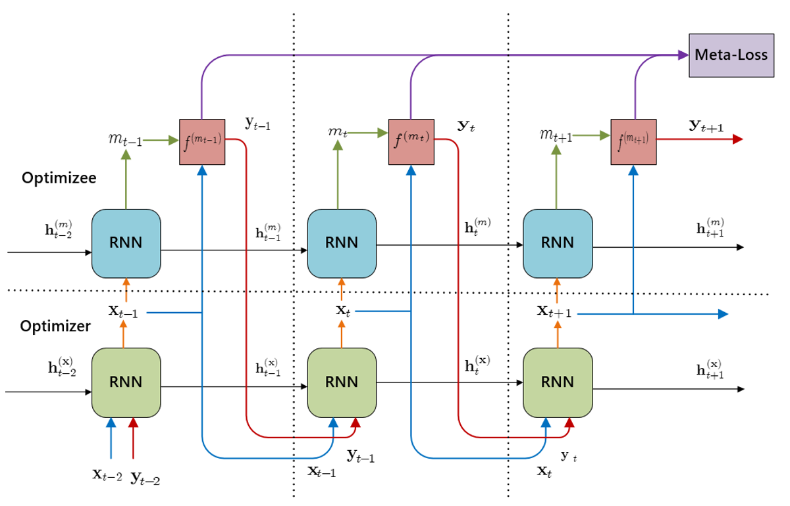
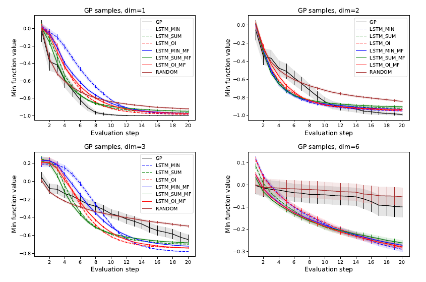
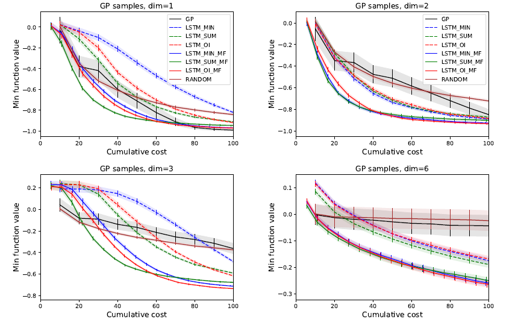

# Neural Meta Learning for Multifidelity Bayesian Optimization
In this study, meta learning is implemented as a multi-layer RNN for multi-fidelity Bayesian optimization. The main goal is to use meta-data to understand how automatic learning can become flexible in solving different kinds of learning problems, hence to improve the performance of existing learning algorithms. We explore the space via cheap or low fidelity and leverage the exploration with high fidelity on a successively smaller region. BO with multifidelity can achieve better performance than that with single fidelity.

In the experiments, we will use a large number of differentiable functions and its auxiliary functions both generated with GP to train an RNN optimizer. Within the training horizon, the RNN optimizers are competitive with heavily engineered packages such as GPflowopt. Our  experiments will show that the RNN optimizer is faster and tends to achieve better performance within the horizon for which it is trained.  Besides, our experiments show that the algorithm  discovers the global optima of a black-box function with minimal cost and
outperforms existing single-fidelity optimization algorithms. Our algorithm explores the space using the cheap lower fidelities, and uses the higher fidelity queries on successively smaller regions, hence is able to converge closer to the global optima with lesser cost.

## Result
### Functions from a GP prior

Average minimum observed function value, with 95% confidence intervals,
as a function of search steps on functions sampled from the training GP distribution

Average minimum observed function value, with 95% condence intervals,
as a cumulative cost on functions sampled from the training GP distribution
